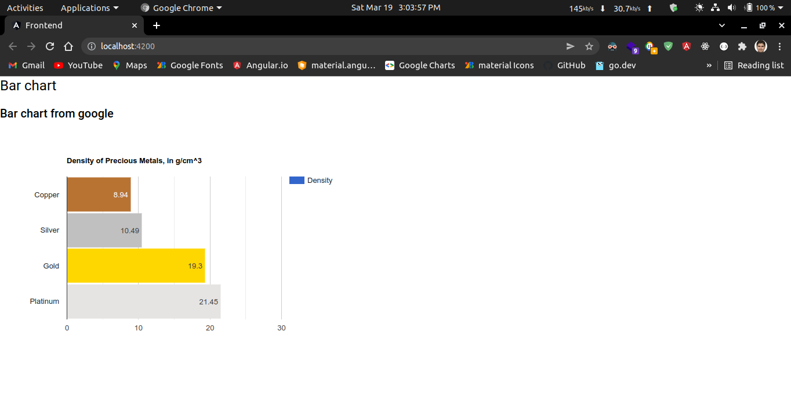

# google-chart

A chart library made by google for creating charts. Use below library to create wide variety of charts with the help of google charts library.

See the official Documentation: [https://developers.google.com/chart/interactive/docs/quick_start](https://developers.google.com/chart/interactive/docs/quick_start)

I have used this above library to make a npm install package so that I can create some demo charts using this npm package.

<p align="center">
  <a href="#">
    
  </a>&nbsp;&nbsp;&nbsp;&nbsp;&nbsp;&nbsp;&nbsp;&nbsp;&nbsp;&nbsp;&nbsp;&nbsp;&nbsp;&nbsp;&nbsp;&nbsp;&nbsp;&nbsp;&nbsp;&nbsp;&nbsp;
  <a href="#">
    
  </a>
</p>

## Installation

You can install google-chart using the following command:

```bash
npm install @arjunshinde/google-chart --save
```

---
---

## Working with Angular

Here is a simple example of how to use **google-chart** in Angular using **`bar chart`**

### 1. Add the path of library to the angular.json file

Open **`Angular.json`** file in your project and paste the following line in **`scripts`** section.

```bash
./node_modules/@arjunshinde/google-chart/google-chart.min.js
```

---

### 2. Create a new component & Initialize the component

In your **root project folder** of your angular application, create a new component.

```bash
ng g c bar-chart
```

Open the **`app.component.html`** file and paste the following code in it.

```html
<app-bar-chart></app-bar-chart>
```

---

### 3. Add view part of bar-chart component

Open the **`bar-chart.component.html`** file and paste the following code.

```html
<div id="canvas_barChart"></div>
```

---

### 4. Add the controller part of bar-chart component

Open the **`bar-chart.component.ts`** file and paste the following code.

```ts
import { Component, OnInit } from '@angular/core';
declare var google: any;

@Component({
  selector: 'app-bar-chart',
  templateUrl: './bar-chart.component.html',
  styleUrls: ['./bar-chart.component.scss'],
})
export class BarChartComponent implements OnInit {
  constructor() {}

  ngOnInit(): void {
    // Initialize the google charts
    google.charts.load('current', { packages: ['corechart'] });
    google.charts.setOnLoadCallback(this.drawChart);
  }

  // drawChart function
  drawChart() {
    // prepare the data
    var data = google.visualization.arrayToDataTable([
      ['Element', 'Density', { role: 'style' }],
      ['Copper', 8.94, '#b87333'],
      ['Silver', 10.49, 'silver'],
      ['Gold', 19.3, 'gold'],
      ['Platinum', 21.45, 'color: #e5e4e2'],
    ]);

    let view = new google.visualization.DataView(data);
    view.setColumns([
      0,
      1,
      {
        calc: 'stringify',
        sourceColumn: 1,
        type: 'string',
        role: 'annotation',
      },
      2,
    ]);

    // customize the chart
    let options = {
      title: 'Density of Precious Metals, in g/cm^3',
      width: 600,
      height: 400,
      bar: { groupWidth: '95%' },
      // legend: { position: 'none' },
    };

    // draw the chart
    let chart = new google.visualization.BarChart(
      document.getElementById('canvas_barChart')
    );
    chart.draw(view, options);
  }
}
```

---

### 5. Run the angular project

```bash
ng serve -o
```

Open the **`localhost:4200`** URL in your browser.

---
---

## Usage demo Sample chart

Below is a sample chart that you can use to test the library.



---
---
